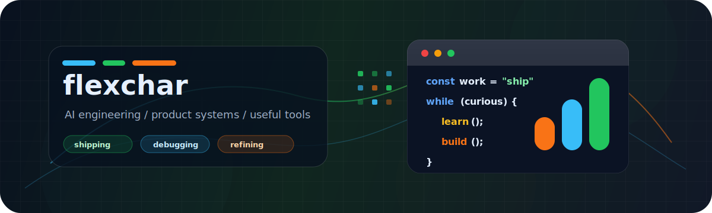

  

  
  
  

<table>
  <tr>
    <td width="58%">
      <h3>Lukas</h3>
      

        Builds practical software with a bias for simple interfaces, fast iteration,
        and code that is easy to come back to later.
      

      

        Moving from a decade of software engineering into AI engineering,
        a shift that began in 2025 with Joe & The Juice. These days, more time goes into learning,
        prototyping, and turning model capabilities into useful systems.
      

      

        That includes catching up with the industry trends, listening to conference talks, 
        prototyping MCP servers and workflow tooling, supporting Claude Enterprise adoption, 
        and all the needed in the middle.
      

    </td>
    <td width="42%">
      
    </td>
  </tr>
</table>

<table>
  <tr>
    <td width="50%">
      
    </td>
    <td width="50%">
      
    </td>
  </tr>
</table>

  
   
  Public contribution graphs show only part of the work: current AI engineering often lives in private experiments, notebooks, and product prototypes.

